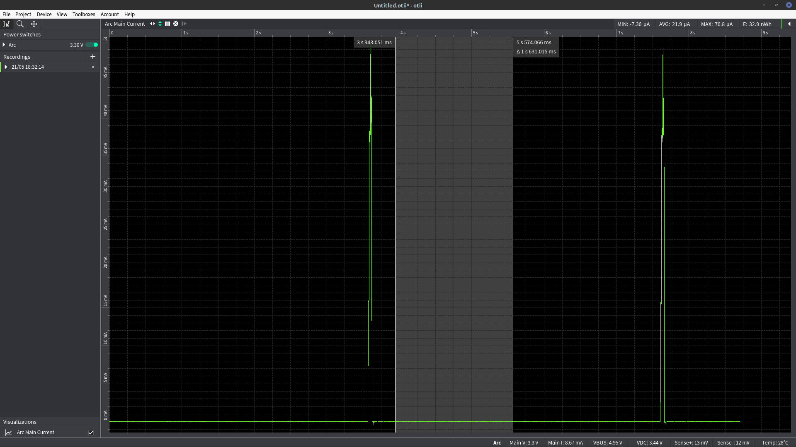
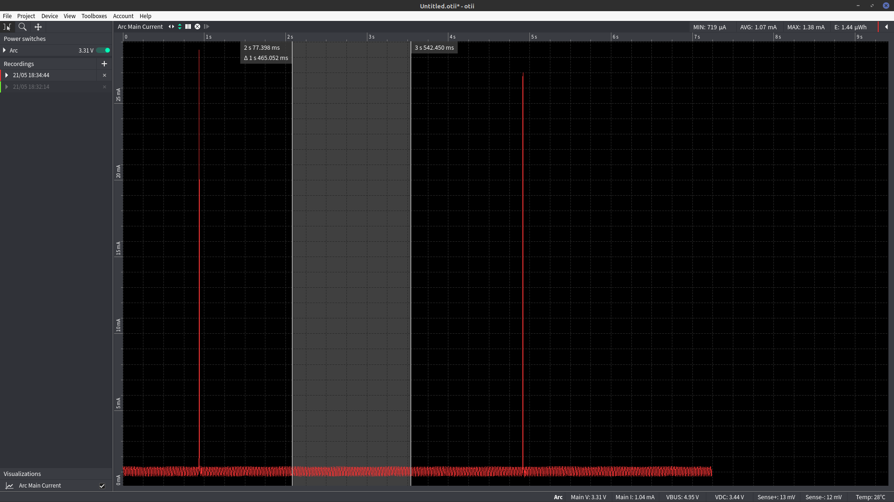
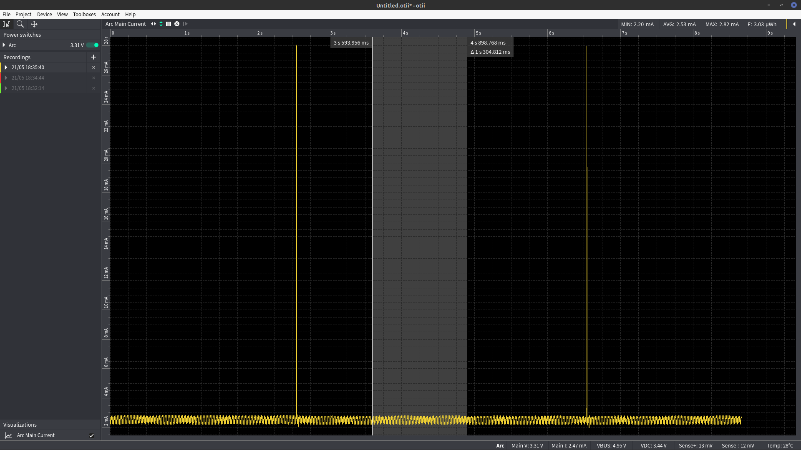

# ESP32 ULP test with ADC
This is a current consumption test for the ultra low power co-processor of the ESP32-PICO-D4 and esp-idf v4.4.1.

The goal is to understand the current consumption of light sleep and deep sleep while the ADC is used by the ULP.

The ULP program will be started every 4ms. After 1000 starts the ULP will make an ADC measurement and wake-up the main CPU, effectively waking up the main CPU every 4 seconds.

The different tests can be conducted via commenting in/out the corresponding code in main.c.

## Current consumption in deep sleep with ADC enabled
Average approximately 24µA

## Current consumption in light sleep without ADC enabled
Average approximately 1.07mA

## Current consumption in light sleep with ADC enabled
Average approximately 2.53mA

